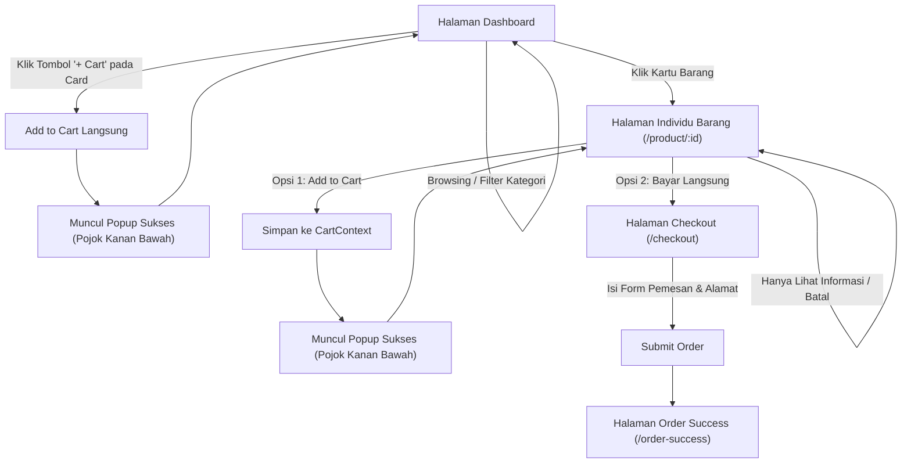

# Rencana Implementasi: Arsitektur E-Commerce dengan React Query, Context, & LocalStorage

Dokumen ini berisi spesifikasi teknis dan rencana implementasi revisi proyek sesuai arahan dosen dan spesifikasi alur pengguna (_user flow_).

---

## 1. Goal Description

Membangun ulang arsitektur web dari model statis menjadi arsitektur modern berbasis:

1. **Database Persisten Lokal (`localStorage`)**: Mensimulasikan REST API / Database lokal _offline-first_ untuk produk, ulasan/rating, pesanan, dan keranjang belanja.
2. **TanStack React Query v5**: Mengelola _server-state_ (query caching, loading & error states, serta data mutation).
3. **React Context (`CartContext` & `ToastContext`)**: Mengelola _client-state_ global untuk item keranjang, badge counter di navbar, dan popup notifikasi keberhasilan di pojok kanan bawah.
4. **Alur Pengguna & Navigasi**:
   - **Dashboard**: Menampilkan katalog barang dengan filter kategori, rating bintang, dan tombol cepat **"+ Cart"** langsung pada card (disertai popup sukses di pojok kanan bawah).
   - **Halaman Individu Barang (`/product/:id`)**: Berpindah dari sekadar modal menjadi halaman detail khusus yang memuat deskripsi lengkap, ulasan pembeli + form ulasan, tombol "Add to Cart", dan tombol "Beli Langsung".
   - **Alur Checkout & Pesanan**: Opsi Beli Langsung (single-item checkout) serta checkout dari keranjang belanja.

---

## 2. User Flow Diagram

---

## 3. User Review Required

> [!IMPORTANT]
> **Library Tambahan yang Akan Dipasang:**
>
> - `@tanstack/react-query` (v5): Standar industri untuk async state & caching.
> - `lucide-react`: Kumpulan ikon modern (Cart, Star, Plus, Check, Trash, Chevron) untuk mempercantik UI card, rating bintang, dan popup.

> [!NOTE]
> **Struktur Data LocalStorage:**
>
> - `end1tech_products`: Menyimpan koleksi barang awal yang diperkaya deskripsi, rating, dan review. Jika belum ada di `localStorage`, akan di-seed otomatis dari data awal.
> - `end1tech_cart`: Menyimpan item keranjang secara persisten (tidak hilang saat refresh).
> - `end1tech_orders`: Menyimpan riwayat transaksi yang berhasil.

---

## 4. Open Questions

Tidak ada pertanyaan penghalang. Rincian sudah sangat spesifik sesuai instruksi:

- Database offline-first menggunakan `localStorage`.
- Tombol "+ Cart" instan pada card item.
- Notifikasi popup di pojok kanan bawah.
- Halaman individu barang di route `/product/:id` dengan 2 opsi (Add to Cart & Bayar Langsung).

---

## 5. Proposed Changes

### Layer 1: Dependencies & Service Storage

#### [MODIFY] [package.json](file:///home/nyomanyogi29/Documents/kuliah/semester-5/teknologi-web/my-app2/package.json)

- Menambahkan `@tanstack/react-query` dan `lucide-react`.

#### [NEW] `src/services/storage.js`

- Berisi fungsi simulasi API async untuk `localStorage`:
  - `getProducts({ category, search })`: Mengembalikan daftar produk (dengan simulasi latency 150ms agar status loading React Query terlihat).
  - `getProductById(id)`: Mengambil 1 produk berdasarkan ID.
  - `addReviewToProduct(productId, review)`: Menambah review baru dan mengkalkulasi ulang rating produk di `localStorage`.
  - `createOrder(orderData)`: Menyimpan data pesanan baru.

#### [MODIFY] [src/data/index.js](file:///home/nyomanyogi29/Documents/kuliah/semester-5/teknologi-web/my-app2/src/data/index.js)

- Menambahkan field `description`, `rating` (contoh: 4.8), `reviewCount` (contoh: 86), dan array `reviews: [{ id, name, rating, comment, date }]` untuk setiap produk.

---

### Layer 2: Context Management

#### [NEW] `src/context/CartContext.jsx`

- Menyediakan:
  - `cartItems`: Array barang yang dibeli (tersinkronisasi dengan `localStorage`).
  - `addToCart(product, quantity)`: Menambah jumlah barang atau menambahkan barang baru.
  - `removeFromCart(productId)`: Menghapus item dari keranjang.
  - `updateQuantity(productId, quantity)`: Ubah jumlah kuantitas.
  - `clearCart()`: Kosongkan keranjang.
  - `totalCartCount` & `totalCartPrice`.

#### [NEW] `src/context/ToastContext.jsx`

- Menyediakan popup notification di **pojok kanan bawah layar** (`fixed bottom-5 right-5 z-50`):
  - Pesan sukses dengan icon centang hijau.
  - Auto-dismiss setelah 3 detik.
  - Dapat dipicu lewat `showToast("Barang berhasil ditambahkan ke keranjang!")`.

---

### Layer 3: React Query Integration

#### [MODIFY] [src/main.jsx](file:///home/nyomanyogi29/Documents/kuliah/semester-5/teknologi-web/my-app2/src/main.jsx)

- Inisialisasi `const queryClient = new QueryClient()` dan bungkus aplikasi dengan `<QueryClientProvider client={queryClient}>`, `<CartProvider>`, dan `<ToastProvider>`.

#### [NEW] `src/hooks/useProducts.js`

- Custom hook `useQuery` untuk mengambil daftar produk terfilter dari service storage.

#### [NEW] `src/hooks/useProductDetail.js`

- Custom hook `useQuery` untuk mengambil 1 detail produk berdasarkan ID param.

#### [NEW] `src/hooks/useAddReview.js`

- Custom hook `useMutation` untuk submit review baru dan menginvalidasi query produk.

---

### Layer 4: UI Components & Pages

#### [MODIFY] [src/components/CatalogCard.jsx](file:///home/nyomanyogi29/Documents/kuliah/semester-5/teknologi-web/my-app2/src/components/CatalogCard.jsx)

- Menampilkan rating bintang (⭐ 4.8) dan jumlah review.
- Menambahkan **Tombol Ikon "+ Cart"** di sudut card:
  - Menggunakan `e.stopPropagation()` agar klik tombol tidak memicu navigasi ke halaman detail.
  - Memanggil `addToCart(product, 1)` dan memicu toast popup di pojok kanan bawah.

#### [NEW] `src/pages/ProductDetail.jsx` (Halaman Individu Barang)

- Mengambil ID dari URL (`useParams()`).
- Menampilkan foto produk besar, kategori, nama, harga per unit, rating bintang keseluruhan, dan deskripsi produk mendalam.
- **Daftar Ulasan & Rating**: Menampilkan review pengguna sebelumnya + form interaktif untuk menambah ulasan baru.
- **Selector Kuantitas**: Tombol `-` dan `+`.
- **2 Opsi Tindakan**:
  1. **Tombol "Tambah ke Keranjang"**: Menambahkan ke `CartContext` + memicu popup sukses di pojok kanan bawah tanpa meninggalkan halaman.
  2. **Tombol "Beli Langsung"**: Langsung mengarahkan ke halaman `/checkout` dengan data produk & kuantitas terpilih.

#### [MODIFY] [src/components/layout/NavBar.jsx](file:///home/nyomanyogi29/Documents/kuliah/semester-5/teknologi-web/my-app2/src/components/layout/NavBar.jsx)

- Menambahkan icon Keranjang Belanja dengan badge counter merah yang menampilkan jumlah barang dari `CartContext`.
- Memperbaiki tautan navigasi menggunakan React Router `<Link>`.

#### [NEW] `src/pages/Cart.jsx`

- Halaman ringkasan keranjang belanja untuk melihat seluruh item, mengubah kuantitas, menghapus item, dan tombol "Lanjut ke Pembayaran" (multi-item checkout).

#### [MODIFY] [src/pages/Checkout.jsx](file:///home/nyomanyogi29/Documents/kuliah/semester-5/teknologi-web/my-app2/src/pages/Checkout.jsx)

- Mendukung dua skenario:
  1. _Beli Langsung_ dari halaman individu barang (menggunakan `location.state`).
  2. _Checkout Keranjang_ dari halaman cart (mengambil semua isi keranjang).
- Saat order selesai dibuat, simpan transaksi ke `localStorage` dan kosongkan keranjang jika checkout dari cart.

#### [MODIFY] [src/App.jsx](file:///home/nyomanyogi29/Documents/kuliah/semester-5/teknologi-web/my-app2/src/App.jsx)

- Mendaftarkan rute baru:
  - `/` -> `Dashboard`
  - `/product/:id` -> `ProductDetail` (Halaman individu barang)
  - `/cart` -> `Cart`
  - `/checkout` -> `Checkout`
  - `/order-success` -> `OrderSuccess`

---

## 6. Verification Plan

### Automated Checks

- `npm run build`: Memastikan tidak ada _syntax error_, _type error_, atau file _missing import_.
- `npm run lint`: Memverifikasi standar kode sesuai ESLint.

### Manual Verification

1. **Fitur Instant Add to Cart pada Dashboard**:
   - Klik tombol "+ Cart" pada salah satu card headphone/smartwatch.
   - Amati popup sukses muncul di pojok kanan bawah layar selama 3 detik.
   - Periksa badge counter di Navbar bertambah sesuai klik.
2. **Navigasi ke Halaman Individu Barang**:
   - Klik card barang (area gambar/judul).
   - Pastikan URL berubah ke `/product/:id` dan halaman menampilkan deskripsi lengkap, rating bintang, dan ulasan.
3. **Aksi di Halaman Individu Barang**:
   - Ubah kuantitas (misal menjadi 2).
   - Klik "Tambah ke Keranjang" -> pastikan popup sukses muncul di pojok kanan bawah dan badge di Navbar bertambah 2.
   - Klik "Beli Langsung" -> pastikan langsung diarahkan ke form `/checkout` dengan item dan jumlah yang tepat.
4. **Verifikasi Persistensi LocalStorage**:
   - Lakukan refresh browser (_F5_).
   - Pastikan isi keranjang belanja tidak hilang dan tetap tersimpan.
